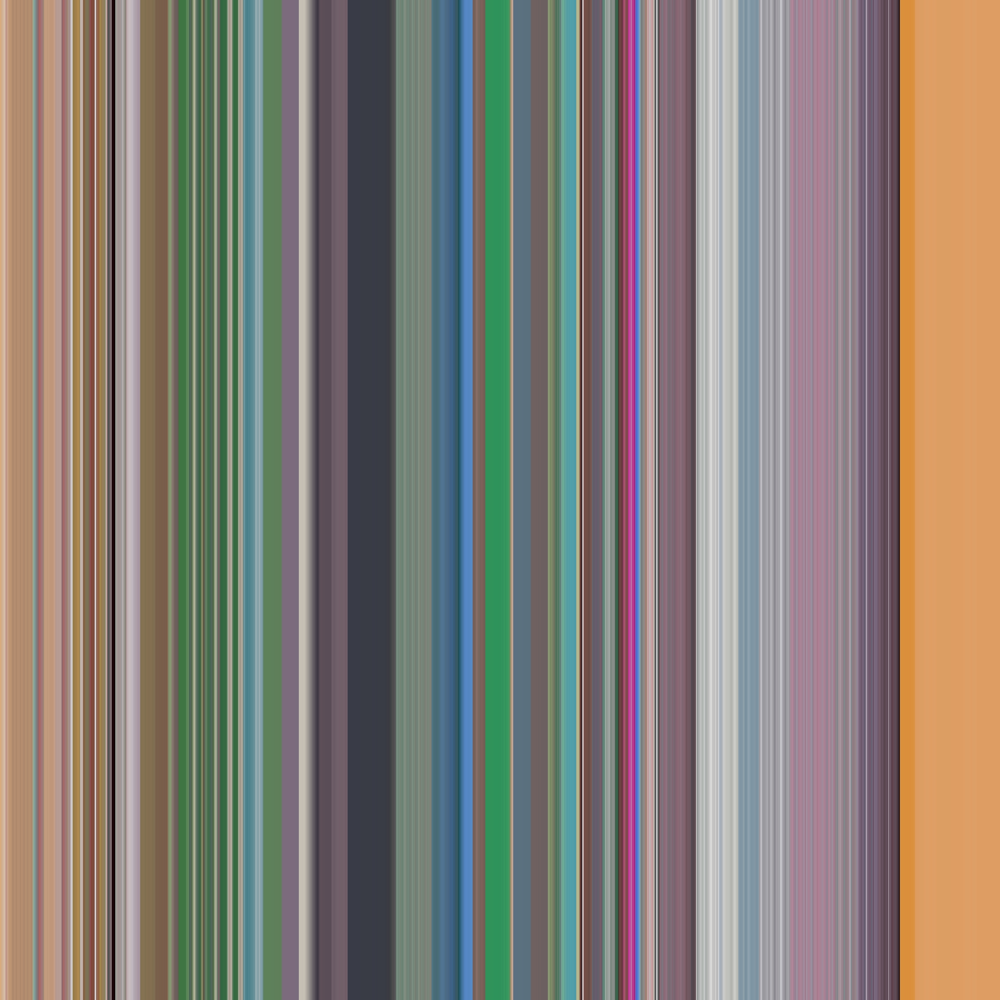

# Video to Barcode converter ([See results here](https://opensea.io/collection/attack-on-titan-barcode-galleri))

Video to barcode converter works by taking a video and going frame by frame and generating a line represeting the average color for that frame with our alogorithm. Then it grabs the videos general media information from imdb and adds that item to a json obj which can be used by my [Opensea-Entry-Bot](Opensea-Entry-Bot) automation bot that uploads the img as an nft to Opensea. This is good when having multiple NFTs you'd like to upload. Each image will be the same size no matter the frame count

## Get imdb ID

To get IMDB id search the movie or episode on imdb and take it from the browser and name your media approximately

Ex. https://www.imdb.com/title/tt4359248

imdbID = 4359248

## Name video media correctly and place in video folder

**_video folder name can be changed if updated to match line 133 in index.py_**

Videos must be formated to match below

**TV shows**

_imdbID-ep-se.mp4_

ex. 4359248-1-1.mp4

**Movies**

_imdbID.mp4_

ex. 4359248.mp4

## Example Video Converted to image and Json obj



```json
{
    "nft": [
        {
            "genres": ["Animation", "Action", "Adventure", "Comedy", "Drama", "Fantasy"],
            "directors": [],
            "name": "Kaken Sakuretsu! Fukkatsu Meramera no Mi no Chikara",
            "rating": 8.9,
            "plot": "The final Colosseum round continues as Rebecca finally remembers her father. Sabo destroys the Colosseum with his Dragon Claw Fists before leaping at the Fighting Fish bearing the Mera Mera no Mi.",
            "image": "C:\\Users\\Admin\\Documents\\Python\\Anime-Frames\\videos-Barcodes\\4359248-1-1.mp4.jpg"
        }
    ]
}
```

#### To turn off imdb media grab, comment out line 145 `GetVideoInfo()`
